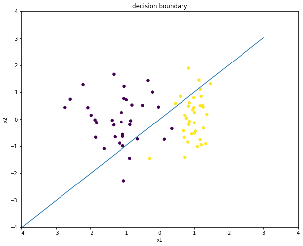
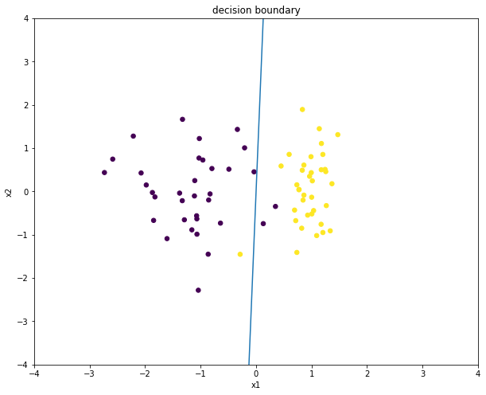
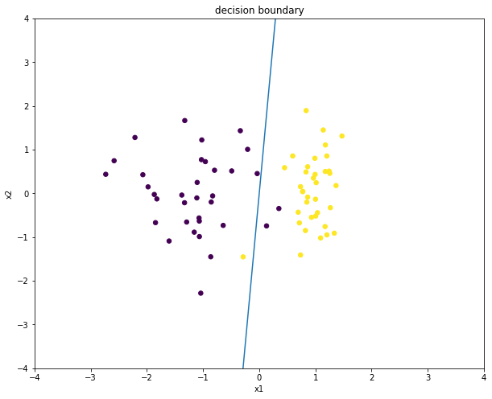
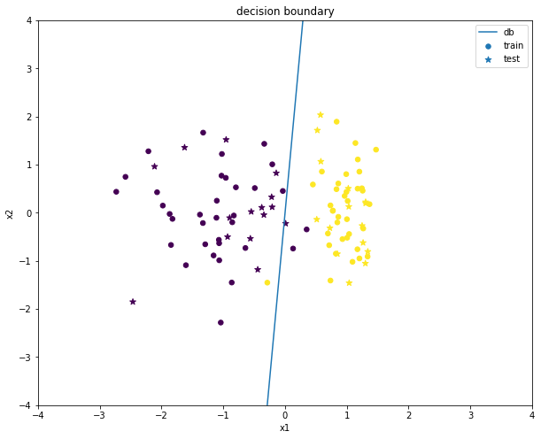

## 逻辑回归  
### 1.初始化__init__(n_iter=100,eta=0.0001,gd='bgd')  
初始化逻辑回归类，默认迭代次数为100，学习率为0.0001，训练为批量梯度下降。训练还可以选择随机梯度下降。


```python
def __init__(self,n_iter = 100,eta = 0.0001,gd = 'bgd'):
    self.n_iter = n_iter
    self.eta = eta
    self.gd = gd
```

### 2.对数函数sigmoid(fx)  
通过对数几率函数将预测值范围限定在0到1之间，并且该函数单调可微


```python
def sigmoid(self,fx):
    return 1/(1+np.exp(-1 * fx))
```

### 3.训练fit(TrainData)  
损失函数为：$L(w)=-\frac{1}{m}\sum\limits_{i=1}^m\{y_iln[h(x_i)]+(1-y_i)ln[1-h(x_i)]\}$   
求偏导得：$\frac{\partial L(w)}{\partial w}=-\frac{1}{m}\sum\limits_{i=1}^m[y_i-h(x_i)]x_i$  
更新权重：$w = w - α\frac{1}{m}\sum\limits_{i=1}^m[h(x_i)-y_i]x$  
(训练方式可选择批量梯度下降或是随机梯度下降，可以通过初始化类时的plot参数选择是否显示决策边界变化情况)


```python
def fit(self,TrainData):
        y_label = np.array(TrainData.label)#获取真实标签集合
        datanum = len(TrainData)#获取数据集大小
        featnum = len(TrainData.columns)-1#获取特征数量
        self.weights = np.zeros((1,featnum))#初始化权重，权重大小为1×featnum

        #批量梯度下降
        if self.gd == 'bgd':
            data = np.array(TrainData[TrainData.columns.tolist()[0:featnum]])#datanum×featnum
            data_T = data.transpose()#数据大小为featnum×datanum
            for n in range(self.n_iter):
                hx = self.sigmoid(np.dot(self.weights,data_T))#预测值，即h(x)=1/(1+e^(-wx))
                self.weights = self.weights - self.eta * np.dot((hx - y_label),data)/datanum#即weights = weights - eta*(h(x)-y)*x/datanum
                
                #可以选择训练过程中绘制决策边界
                if self.plot == True:
                    if n % (self.n_iter/10) == 0:
                        self.plotDecisionBoundary(TrainData)
            if self.plot == True:
                self.plotDecisionBoundary(TrainData)
                
            return self.weights
        
        #随机梯度下降
        if self.gd == 'sgd':
            for n in range(self.n_iter):
                x = random.randint(0,datanum-1)
                datax = np.array(TrainData[TrainData.columns.tolist()[0:featnum]])[x]
                datax_T = datax.transpose()
                hxx = self.sigmoid(np.dot(self.weights,datax_T))
                self.weights = self.weights - self.eta * (hxx - y_label[x]) * datax#即weights = weights - eta*(h(x)-y)*x/datanum
                
                #可以选择训练过程中绘制决策边界
                if self.plot == True:
                    if n % (self.n_iter/10) == 0:
                        self.plotDecisionBoundary(TrainData)
            if self.plot == True:
                self.plotDecisionBoundary(TrainData)
                
            return self.weights
```

### 4.预测单个样本类别predict(testData)  
当$w·x > 0$时为1，当$w·x < 0$时为0


```python
def predict(self,testData):
    flag = np.dot(self.weights,testData)
    if flag > 0:
        pred = 1
    else:
        pred = 0
    return pred
```

### 5.求准确率accuracy(TestData)  


```python
def accuracy(self,TestData):
    num = 0
    for i in range(len(TestData)):
        temp = np.array(TestData.iloc[i][0:len(TestData.columns)-1]).reshape(len(TestData.columns)-1,1)
        if self.predict(temp)==TestData.label.tolist()[i]:
            num = num + 1
    return num/len(TestData)
```

### 6.绘制决策边界plotDecisionBoundary(TrainData)


```python
def plotDecisionBoundary(self,TrainData):
    fig=plt.figure(figsize=(10,8))
    plt.xlim(-4,4)  #  设置x轴刻度范围
    plt.ylim(-4,4)  #  设置y轴刻度范围
    plt.xlabel('x1')   
    plt.ylabel('x2')
    plt.title('decision boundary') 
    x1 = np.arange(-4,4,1)
    x2 =-1 * model_lr.weights[0][0] / model_lr.weights[0][1] * x1
    plt.scatter(TrainData[TrainData.columns[0]], TrainData[TrainData.columns[1]], c=TrainData['label'], s=30)
    plt.plot(x1,x2)
    plt.show()
```


```python
import numpy as np       
import pandas as pd
import random
from sklearn.model_selection import train_test_split
from sklearn import preprocessing
import matplotlib.pyplot as plt
```


```python
class LogisticRegression():
    def __init__(self,n_iter = 100,eta = 0.0001,gd = 'bgd',plot = False):
        self.n_iter = n_iter
        self.eta = eta
        self.gd = gd
        self.plot = plot
        
    def sigmoid(self,fx):
        return 1/(1+np.exp(-1 * fx))
    
    def fit(self,TrainData):
        y_label = np.array(TrainData.label)#获取真实标签集合
        datanum = len(TrainData)#获取数据集大小
        featnum = len(TrainData.columns)-1#获取特征数量
        self.weights = np.zeros((1,featnum))#初始化权重，权重大小为1×featnum

        #批量梯度下降
        if self.gd == 'bgd':
            data = np.array(TrainData[TrainData.columns.tolist()[0:featnum]])#datanum×featnum
            data_T = data.transpose()#数据大小为featnum×datanum
            for n in range(self.n_iter):
                hx = self.sigmoid(np.dot(self.weights,data_T))#预测值，即h(x)=1/(1+e^(-wx))
                self.weights = self.weights - self.eta * np.dot((hx - y_label),data)/datanum#即weights = weights - eta*(h(x)-y)*x/datanum
                
                #可以选择训练过程中绘制决策边界
                if self.plot == True:
                    if n % (self.n_iter/5) == 0:
                        self.plotDecisionBoundary(TrainData)
            if self.plot == True:
                self.plotDecisionBoundary(TrainData)
                
            return self.weights
        
        #随机梯度下降
        if self.gd == 'sgd':
            for n in range(self.n_iter):
                x = random.randint(0,datanum-1)
                datax = np.array(TrainData[TrainData.columns.tolist()[0:featnum]])[x]
                datax_T = datax.transpose()
                hxx = self.sigmoid(np.dot(self.weights,datax_T))
                self.weights = self.weights - self.eta * (hxx - y_label[x]) * datax#即weights = weights - eta*(h(x)-y)*x/datanum
                
                #可以选择训练过程中绘制决策边界
                if self.plot == True:
                    if n % (self.n_iter/5) == 0:
                        self.plotDecisionBoundary(TrainData)
            if self.plot == True:
                self.plotDecisionBoundary(TrainData)
                
            return self.weights
                
    def predict(self,testData):
        flag = np.dot(self.weights,testData)
        if flag > 0:
            pred = 1
        else:
            pred = 0
        return pred
    
    def accuracy(self,TestData):
        num = 0
        for i in range(len(TestData)):
            temp = np.array(TestData.iloc[i][0:len(TestData.columns)-1]).reshape(len(TestData.columns)-1,1)
            if self.predict(temp)==TestData.label.tolist()[i]:
                num = num + 1
        return num/len(TestData)
    
    def plotDecisionBoundary(self,TrainData):
        fig=plt.figure(figsize=(10,8))
        plt.xlim(-4,4)  #  设置x轴刻度范围
        plt.ylim(-4,4)  #  设置y轴刻度范围
        plt.xlabel('x1')   
        plt.ylabel('x2')
        plt.title('decision boundary') 
        x1 = np.arange(-4,4,1)
        x2 =-1 * self.weights[0][0] * x1 / self.weights[0][1]
        plt.scatter(TrainData[TrainData.columns[0]], TrainData[TrainData.columns[1]], c=TrainData['label'], s=30)
        plt.plot(x1,x2)
        plt.show()
```

## 导入数据集进行测试  
### pima数据集


```python
#导入数据集
pima = pd.read_csv('E:\Desktop\DataSet\pima-indians-diabetes.csv')
pd0 = pima[pima.columns.tolist()[0:len(pima.columns)-1]]
pd1 = pima['label']
#归一化
pd0=pd.DataFrame(preprocessing.scale(pd0))
pima = pd.concat([pd0,pd1],axis=1)
pima_train,pima_test = train_test_split(pima,test_size=0.3)
#定义模型：迭代1000次，学习率默认为0.0001，训练方式随机梯度下降
model_lr1 = LogisticRegression(n_iter=1000,gd='sgd')
#训练模型
model_lr1.fit(pima_train)
print("训练集精确率：",model_lr1.accuracy(pima_train))
print("测试集精确率：",model_lr1.accuracy(pima_test))
print("权重为：",model_lr1.weights[0])
```

    训练集精确率： 0.7281191806331471
    测试集精确率： 0.7142857142857143
    权重为： [ 0.01310102  0.02336091  0.00671498  0.00200135  0.00268077  0.01497984
      0.00956954  0.01431394]
    

### 随机生成的二分类数据集


```python
#导入数据集
data = pd.read_csv('E://Desktop//DataSet//test.csv')
#划分数据集
data_train,data_test = train_test_split(data,test_size=0.3)
#定义模型：迭代次数默认100，学习率默认0.0001，训练方式默认批量梯度下降，显示决策边界变化情况
model_lr2 = LogisticRegression(gd='sgd',plot=True)
model_lr2.fit(data_train)
print("训练集精确率：",model_lr2.accuracy(data_train))
print("测试集精确率：",model_lr2.accuracy(data_test))
print("权重为：",model_lr2.weights[0])
```











    训练集精确率： 0.9571428571428572
    测试集精确率： 0.9666666666666667
    权重为： [ 0.00554719 -0.00040013]
    

**绘制训练集和测试集以及决策边界**   
训练集以圆点表示，测试集以五角星表示


```python
fig=plt.figure(figsize=(10,8))
plt.xlim(-4,4)  #  设置x轴刻度范围
plt.ylim(-4,4)  #  设置y轴刻度范围
plt.xlabel('x1')   
plt.ylabel('x2')
plt.title('decision boundary') 
x1 = np.arange(-4,4,1)
x2 =-1 * model_lr2.weights[0][0] / model_lr2.weights[0][1] * x1
plt.scatter(data_train['x1'], data_train['x2'], c=data_train['label'], s=30, marker='o')
plt.scatter(data_test['x1'], data_test['x2'], c=data_test['label'], s=50, marker='*')
plt.plot(x1,x2)
plt.legend(["db","train","test"])
plt.show()
```





**逻辑回归的训练过程还可以进一步优化，包括L1、L2正则化，或是衰减学习率等，这些后续会逐步加上**
